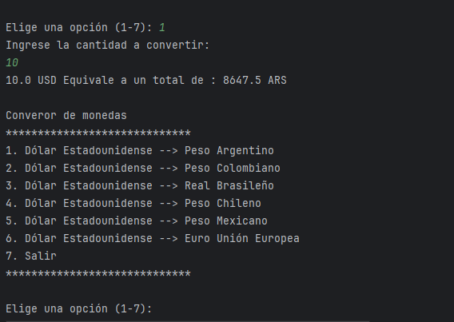

# Conversor de Moneda

Este proyecto es un  conversor de moneda que utilize una API para obtener tasas de cambio en tiempo real y permite al usuario convertir una cantidad de una moneda a otra. La conversión se realiza utilizando las tasas de cambio proporcionadas por la API.

## Funcionalidades

- Conversión de una moneda base  a otra (por ejemplo, de dólares estadounidenses a euros).
- Selección de la cantidad a convertir.
- Visualización del resultado de la conversión.

## Uso

Para ejecutar el programa, simplemente ejecuta la clase Principal. Esto mostrará un menú con opciones para seleccionar la conversión de moneda deseada.

Una vez seleccionada la conversión deseada, se te pedirá que ingreses la cantidad que deseas convertir. Asegúrate de ingresar un número entero válido cuando se solicite la cantidad.

Después de ingresar la cantidad, el programa realizará la conversión y mostrará el resultado en la consola.

## Configuración

No se requiere ninguna configuración adicional para ejecutar este proyecto.

## Contribuciones

Las contribuciones son bienvenidas.

